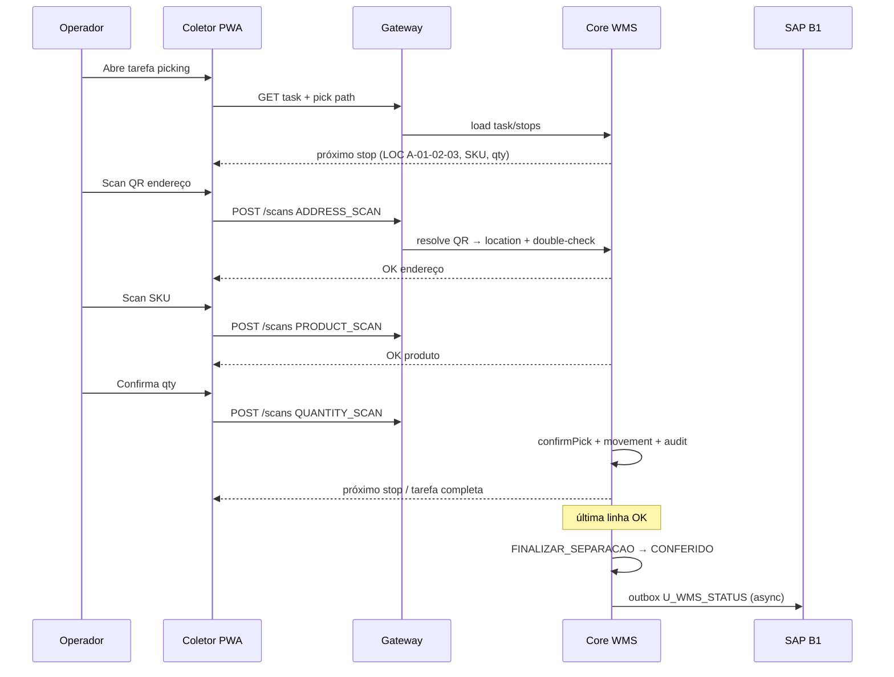

# Plano: Separação de Pedidos com Scanner de QR Codes do Mapa do Pátio

## 1. Objetivo e escopo

Permitir que o operador da distribuidora **separe produtos de pedidos em estoque** guiado pelo **mapa do pátio**, bipando **QR codes físicos** afixados nos endereços (corredores, posições, staging, expedição).

**Entrada:** pedido SAP/WMS em `A_SEPARAR`  
**Saída:** pedido `CONFERIDO` com bipagens auditadas, estoque de endereço atualizado e status refletido no SAP (`U_WMS_STATUS`)

**Fora de escopo deste plano (próximas ondas):** wave picking multi-pedido avançado, roteirização de frota, inventário cíclico completo via QR (pode reutilizar a mesma camada de identidade).

---

## 2. Contexto atual do produto (o que já existe)

| Capacidade | Estado | Onde |
|---|---|---|
| Máquina de estados do pedido | Pronta | `STATE_MACHINE.json`, `wms-core` |
| Tarefas PICKING → PACKING → SHIPPING | Domínio pronto | `wms-core/src/domain/task.ts` |
| Double-check endereço → SKU → qty | Domínio + testes | `doubleCheckService.ts` |
| Schema de `locations` / `location_assignments` | Migrado, pouco usado em runtime | `0002_locations_inventory.sql` |
| Estoque SAP por depósito | Em produção (espelho) | `core` + gateway sync |
| Coletor PWA (câmera + BT) | Protótipo; sync mockada | `collector/` |
| QR como entidade de negócio | **Inexistente** | — |
| Mapa visual do pátio | **Inexistente** | — |
| API de scans → double-check real | Stub | `api/services/stubServices.ts` |

**Princípio:** reutilizar state machine, tasks e double-check; **não** inventar um segundo fluxo de status. A lacuna principal é **endereço físico + QR + estoque por posição + wiring ponta a ponta**.

---

## 3. Visão da solução

```
┌─────────────┐   sync    ┌──────────────┐  gera pick path  ┌─────────────────┐
│  SAP B1     │ ────────► │ Pedido WMS   │ ───────────────► │ Tarefa PICKING  │
│ Sales Order │           │ A_SEPARAR    │                  │ + stops ordenados│
└─────────────┘           └──────────────┘                  └────────┬────────┘
                                                                     │
                                                                     ▼
┌─────────────┐  QR scan  ┌──────────────┐  valida          ┌─────────────────┐
│ QR no pátio │ ────────► │ Coletor PWA  │ ───────────────► │ Core: double-   │
│ (location)  │           │ / gateway    │                  │ check + reserve │
└─────────────┘           └──────────────┘                  └────────┬────────┘
                                                                     │
                     ┌───────────────────────────────────────────────┘
                     ▼
        location_assignments ↓ · scan_events · order → CONFERIDO · SAP UDF
```

Fluxo operacional do operador:

1. Abre fila de tarefas no coletor (ou recebe pedido do kanban).
2. Vê **próximo endereço** no mapa/lista + instrução “vá até X e bip o QR”.
3. Bipa **QR do endereço** → sistema confirma localização.
4. Bipa **SKU** (etiqueta do produto) → confirma item.
5. Informa/bip **quantidade** → confirma linha (ou registra falta).
6. Sistema libera o próximo stop até zerar a tarefa → `FINALIZAR_SEPARACAO` → `CONFERIDO`.

---

## 4. Modelo de identidade: QR do pátio

### 4.1 O que o QR representa

Cada QR físico aponta para um **endereço canônico** (`locations.code`), não para um pedido.

Payload sugerido (URL ou JSON compacto, versionado):

```
GSN|v1|LOC|<location_code>
```

Exemplos:

- `GSN|v1|LOC|A-01-02-03` — posição de picking
- `GSN|v1|LOC|STG-01` — staging / área de montagem
- `GSN|v1|LOC|SHIP-DOCA-2` — doca de expedição

Opcional (ondas futuras):

- `GSN|v1|PLT|<pallet_id>` — pallet/volume montado
- `GSN|v1|SKU|<sku>|<lot>` — etiqueta de produto (hoje o coletor já trata barcode/SKU)

### 4.2 Cadastro mestre

| Entidade | Responsabilidade |
|---|---|
| `locations` | Endereço físico (zona, corredor, coluna, nível, tipo, capacidade, bloqueio) |
| `location_qrcodes` (nova) | `qr_payload` único → `location_id`, versão, ativo, impresso_em, reimpressões |
| Mapa (`yard_map` / metadata) | Layout 2D: zonas, polígonos/células, coordenadas relativas dos endereços |

**Regras:**

- Um endereço ativo → um QR ativo (reimpressão invalida o anterior ou mantém alias com auditoria).
- QR desconhecido → erro claro no coletor (`QR_UNKNOWN`).
- QR de endereço bloqueado → `LOCATION_BLOCKED`.
- QR de tipo incompatível com a etapa (ex.: bipar doca no meio do picking) → `LOCATION_TYPE_MISMATCH`.

### 4.3 Operação de etiquetagem

1. Admin cadastra/importa mapa do pátio (CSV/Excel ou UI).
2. Sistema gera lote de QR codes (PDF/ZPL para impressora térmica).
3. Equipe afixa etiquetas; checklist de validação (“bipar e confirmar no mapa”).
4. Mudança de layout = reimpressão + rebind + histórico.

---

## 5. Estoque: depósito SAP × endereço WMS

Hoje o espelho operacional é **por warehouse SAP**. A separação por QR exige **estoque por endereço**.

### 5.1 Fonte de verdade por camada

| Camada | Fonte | Uso |
|---|---|---|
| Disponibilidade comercial / BI | `inventory_stock` (SAP) | Cotação, catálogo, BI |
| Picking físico | `location_assignments` | Onde buscar, quanto reservar |
| Auditoria | `location_movements` + `scan_events` | Rastreio |

### 5.2 Alocação (allocation) no início da separação

Quando o pedido recebe `INICIAR_SEPARACAO`:

1. Para cada `order_item`, escolher endereços pickable com saldo (`v_locations_pickable` / FEFO se houver validade).
2. Criar **reservas** (`reserved_quantity`) nos endereços escolhidos.
3. Gerar **pick path**: lista ordenada de stops `(location_code, sku, qty, lot?)`.
4. Persistência ligada à `task` / `task_lines`.

Se não houver saldo endereçado suficiente:

- Bloquear início **ou** iniciar com linhas em `SHORTAGE_PENDING` (política configurável por depósito).
- Alertar supervisor; não “inventar” endereço.

### 5.3 Confirmação de pick (bip OK)

Em cada linha concluída:

1. Debitar `location_assignments.quantity` / liberar reserva.
2. Registrar `location_movements` tipo `PICKING` (from = endereço, to = staging do pedido ou null).
3. Atualizar `task_lines.scanned_quantity`.
4. Opcional: espelhar movimento agregado no SAP só no despacho (evitar chatter) — política a fechar com operação.

### 5.4 Reconciliação

Job diário: somatório por SKU em `location_assignments` × `inventory_stock` do depósito; divergências → fila de ajuste (`inventory_adjustments`).

---

## 6. Fluxo ponta a ponta (happy path)



### Estados e eventos (já existentes)

- `A_SEPARAR` + `INICIAR_SEPARACAO` → `EM_SEPARACAO` (gera tarefas + allocation + pick path)
- Durante `EM_SEPARACAO`: apenas scans/ajustes de falta (itens imutáveis — INV-002)
- Todas as linhas OK (ou faltas aprovadas) + `FINALIZAR_SEPARACAO` → `CONFERIDO`
- Demais estados (cotação/coleta/despacho) permanecem como hoje

---

## 7. Double-check e regras de bipagem

Manter a sequência canônica já modelada:

1. **ADDRESS_SCAN** — QR deve resolver para o `expected_location` do stop atual (ou de um stop ainda pendente da mesma tarefa, se multi-SKU no mesmo endereço for permitido).
2. **PRODUCT_SCAN** — SKU/lote deve bater com a linha esperada naquele endereço.
3. **QUANTITY_SCAN** — qty ≤ pendente; qty parcial cria subtarefa ou marca linha parcial conforme política.

Erros padrão (sugeridos):

| Código | Situação |
|---|---|
| `QR_UNKNOWN` | Payload não cadastrado |
| `QR_INACTIVE` | QR substituído/reimpresso |
| `WRONG_LOCATION` | Endereço ≠ esperado |
| `WRONG_SKU` | Produto ≠ esperado |
| `QTY_EXCEEDED` | Quantidade acima do pendente |
| `TASK_LOCKED` | Tarefa de outro operador |
| `DUPLICATE_SCAN` | Idempotência (mesmo `idempotencyKey`) |
| `LOCATION_BLOCKED` | Endereço bloqueado |

Toda bipagem grava `scan_events` append-only (INV-001 / auditoria).

---

## 8. Mapa do pátio (UX)

### 8.1 Papéis

| Papel | UX |
|---|---|
| Admin / layout | Cadastro de zonas, importação, geração de QR, bloqueio de endereço |
| Supervisor | Kanban de pedidos, progresso por zona, faltas, mapa “quente” |
| Operador | Coletor: **próximo stop em destaque** + mini-mapa ou lista ordenada; câmera/BT |

### 8.2 Princípios de UI do operador

- Uma coisa por vez: “vá para **A-01-02-03** → bipar QR”.
- Mapa como **âncora espacial**, não dashboard (sem cards/stats no fluxo de bipagem).
- Destacar apenas o stop atual; stops concluídos em estado secundário.
- Feedback imediato OK/erro (som + cor + vibração).
- Offline-first: fila local de scans com sync real (substituir mock do `collector`).

### 8.3 Dados do mapa

Mínimo viável:

- Zonas com ordem de picking (ex.: ZONA_A → ZONA_B → EXPEDICAO)
- Cada `location` com `map_x`, `map_y` (ou célula grade) em `metadata` / tabela `yard_map_cells`
- Path ordering: zone order → aisle → column → level (simples e suficiente no MVP)

Otimização de caminho (TSP) fica para onda 2, se o pátio justificar.

---

## 9. Arquitetura técnica (alinhada ao repo)

Respeitar `docs/ARCHITECTURE.md`:

- **Gateway (Node/TS):** auth, rate limit, BFF do coletor, SSE para painel.
- **Core (regras duras):** state machine, double-check, allocation, reservas, movimentos.
- **API WMS (`api/`):** expor scans reais (sair do stub), CRUD locations/QR, pick path.
- **Collector:** integrar `POST /api/v1/scans` + auth; sync de fila offline.
- **Worker:** outbox SAP; job de reconciliação endereço × depósito; geração de PDFs de etiqueta.
- **Redis:** lock por `taskId`/`orderId`; idempotência de scan.
- **Painel / web-next:** tela admin de mapa + progresso de separação.

### APIs novas/essenciais (contrato)

```
POST   /api/v1/yard/locations                 # CRUD endereço
POST   /api/v1/yard/qrcodes/generate          # lote de QR
GET    /api/v1/yard/map                       # layout + locations
POST   /api/v1/orders/:id/events              # INICIAR_SEPARACAO (já existe)
GET    /api/v1/tasks/:id/pick-path            # stops ordenados
POST   /api/v1/scans                          # ADDRESS | PRODUCT | QUANTITY (ligar double-check)
POST   /api/v1/tasks/:id/shortage             # registrar falta
GET    /api/v1/yard/qrcodes/resolve?payload=  # debug/admin
```

Payload de scan (conceito):

```json
{
  "taskId": "...",
  "type": "ADDRESS_SCAN",
  "value": "GSN|v1|LOC|A-01-02-03",
  "idempotencyKey": "op-device-ts-uuid",
  "actorId": "...",
  "deviceId": "..."
}
```

---

## 10. Ondas de entrega

### Onda 0 — Fundação de dados (bloqueante)

- Aplicar/validar migração `0002_locations_inventory`.
- Tabela `location_qrcodes` + índices únicos de payload.
- Seed do pátio real (CSV) + tipos PICKING/STAGING/SHIPPING.
- Script de geração/impressão de QR (PDF/ZPL).
- Critério de pronto: 100% dos endereços pickable com QR ativo bipável em ambiente de homologação.

### Onda 1 — Allocation + pick path + scans reais

- Serviço de alocação por SKU → endereços.
- `INICIAR_SEPARACAO` cria tarefas + reservas + pick path.
- Ligar `POST /scans` ao `validateDoubleCheckSequence` + `confirmPick`.
- Coletor: sync real (não mock); fluxo endereço → SKU → qty.
- Critério: pedido demo percorre `A_SEPARAR` → `CONFERIDO` só com bipagens válidas.

### Onda 2 — Mapa + operação diária

- UI admin do mapa (zonas + posições).
- Mini-mapa no coletor com stop atual.
- Faltas + aprovação supervisor.
- Locks Redis; idempotência; SSE de progresso no kanban.
- Critério: turno completo em homologação com 2+ operadores sem cruzar tarefas.

### Onda 3 — SAP + reconciliação + hardening

- Outbox de status WMS no SAP ao iniciar/finalizar.
- Job de reconciliação endereço × `inventory_stock`.
- Políticas de putaway (entrada de mercadoria endereçada).
- Observabilidade: métricas de bip/erro, tempo por stop, hotspots de falta.
- Critério: divergência inventário dentro do limiar acordado; runbook de incidente.

---

## 11. Casos excepcionais (obrigatórios no desenho)

| Cenário | Tratamento |
|---|---|
| Falta no endereço | `shortage` na linha; tentar reallocar outro endereço; senão falta aprovada |
| QR danificado | Reimpressão com novo payload ou alias; bip legado até cutover |
| Operador offline | Fila local; ao sync, revalidar (pode falhar se outro já pegou o saldo) |
| Dois operadores no mesmo pedido | Lock exclusivo da tarefa; ou split por zona (config) |
| Endereço bloqueado mid-pick | Forçar reallocation dos stops restantes |
| Scan fora de ordem | Rejeitar; mostrar endereço esperado |
| Pedido alterado no SAP após início | INV-002: ignorar alteração de itens; divergência vai para fila manual |
| Overpicking | Bloquear; só supervisor ajusta |

---

## 12. Segurança, auditoria e conformidade operacional

- RBAC: `operator` bipa; `supervisor` libera falta/bloqueio; `admin` muda mapa/QR.
- ABAC leve por `warehouseId` / praça (SP vs BH).
- Todo scan e transição com `actor`, `occurredAt`, `idempotencyKey`.
- Sem PII no QR do pátio (só código de endereço).
- Rate limit no endpoint de scans; correlacionar com `X-Correlation-Id`.

---

## 13. Testes e validação

| Camada | Foco |
|---|---|
| Unit | Parse/resolve QR; allocation FEFO; path order |
| Domain | Double-check (já existe — expandir casos de QR) |
| API | Scans OK/erro; idempotência; lock de tarefa |
| E2E | Pedido SAP mock → picking completo → `CONFERIDO` |
| Campo | Homologação com etiquetas reais + scanners BT + câmera |

Checklist operacional de go-live:

- [ ] Mapa conferido com chão de pátio
- [ ] Todas as posições pickable etiquetadas e bipadas
- [ ] Treino operadores (15–20 min de fluxo feliz + faltas)
- [ ] Rollback: modo lista sem mapa se UI falhar; bipagem continua

---

## 14. Decisões abertas (fechar com operação)

1. **Estoque endereçado inicial:** inventário físico completo vs. putaway gradual a partir de entradas novas?
2. **Momento de baixar SAP:** por bip, por pedido conferido, ou só no despacho?
3. **Multi-SKU no mesmo endereço:** permitir bipagem em qualquer ordem das linhas daquele endereço?
4. **Split de pedido entre operadores:** por zona ou um pedido = um operador no MVP?
5. **Formato de impressão:** ZPL (Zebra) vs. PDF A4 para início?

---

## 15. Resumo executivo

A solução correta neste repositório **não** é um módulo paralelo de “QR magic”: é **completar o WMS de separação** ligando três peças — **mapa/endereços + identidade QR + estoque por posição** — ao fluxo que já existe (`A_SEPARAR` → bipagem double-check → `CONFERIDO`).

Ordem de valor:

1. Cadastro real do pátio e QR imprimíveis  
2. Alocação e pick path na abertura da separação  
3. Scans reais no coletor (fim do stub/mock)  
4. Mapa como guia espacial  
5. SAP + reconciliação e operação assistida (faltas, locks, métricas)

Com isso, o scanner deixa de ser só um leitor de código e vira o **elo entre o pedido, o chão do pátio e o estoque endereçado**.
